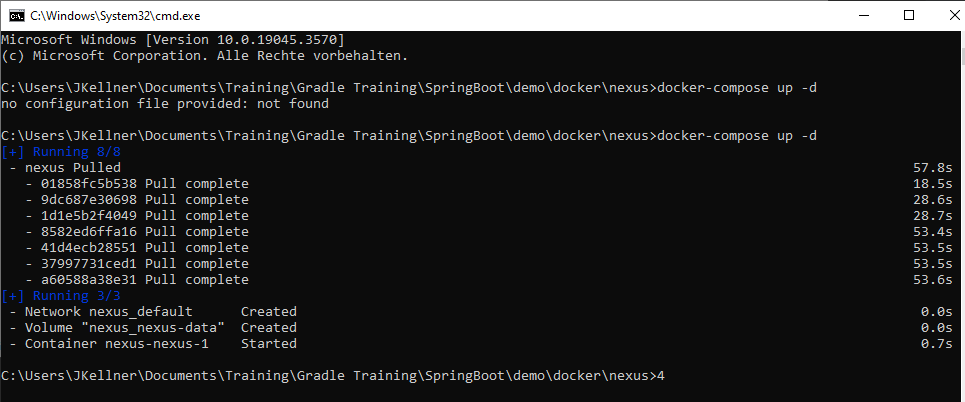

# Install Docker Image

1. Starten in dem Ordner mit dem Skript
2. Lt Konvention muss das docker-compose File docker-compose.yml heißen 

Hochfahren 
```
docker-compose up -d
```



### Nexus 
```
localhost:8081
```

### Passwort von Nexus auslesen 
```
docker ps
docker exec -it nexus-nexus-1 /bin/bash
cat /nexus-data/admin.password
```

### Password bspw:
```
5d9e9730-77df-46fe-9ea6-23fe2b997b31
```

#### Bspw publish 
```
 .\gradlew :Lib:clean :Lib:build :Lib:publish
```

#### Removed container
```
docker-compose down -v 
```